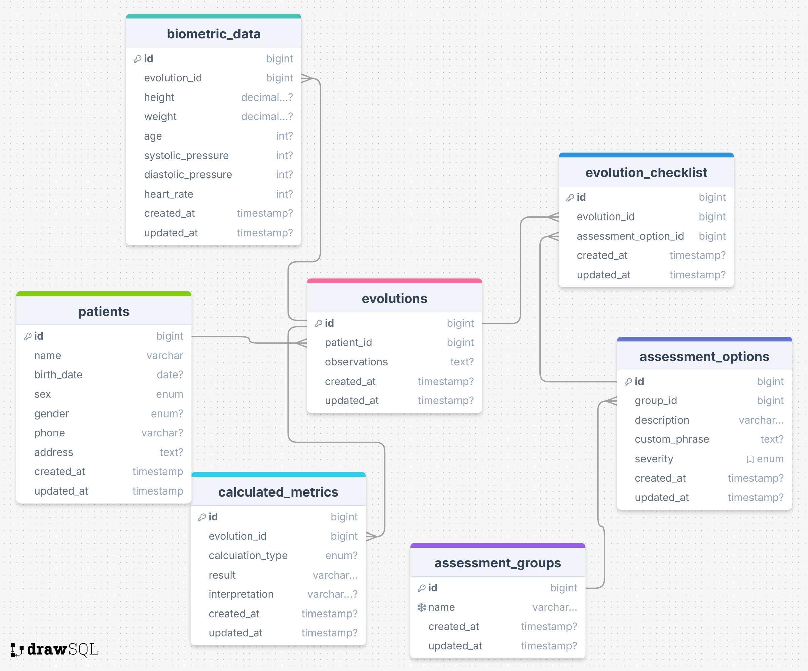

# Diagrama do Banco de Dados

## Diagrama

## 📋 Relações entre Tabelas

A tabela **`patients`** armazena os dados dos pacientes do sistema e possui os seguintes relacionamentos:

- **1:N com `evolutions` (Evoluções de Atendimento)**
    - Um paciente pode ter **várias evoluções** (registros de atendimento/consulta).
    - A chave estrangeira `evolutions.patient_id` referencia `patients.id`.
    - Se um paciente for excluído, todas as suas evoluções também serão removidas (`ON DELETE CASCADE`).

Outras tabelas que se relacionam indiretamente com `patients` por meio de `evolutions`:

- **`biometric_data` (Dados Biométricos)**
    - Cada evolução pode conter **um registro biométrico** (altura, peso, pressão arterial etc.).
    - Relacionamento **1:1** entre `evolutions` e `biometric_data`.
    - Chave estrangeira: `biometric_data.evolution_id` referencia `evolutions.id`.

- **`calculated_metrics` (Métricas Calculadas)**
    - Cada evolução pode ter **várias métricas calculadas** (IMC, pressão arterial etc.).
    - Relacionamento **1:N** entre `evolutions` e `calculated_metrics`.
    - Chave estrangeira: `calculated_metrics.evolution_id` referencia `evolutions.id`.

- **`evolution_checklist` (Checklist de Avaliação)**
    - Cada evolução pode ter **várias avaliações registradas**.
    - Relacionamento **N:N** entre `evolutions` e `assessment_options` por meio de `evolution_checklist`.
    - Chaves estrangeiras:
        - `evolution_checklist.evolution_id` referencia `evolutions.id`.
        - `evolution_checklist.assessment_option_id` referencia `assessment_options.id`.

